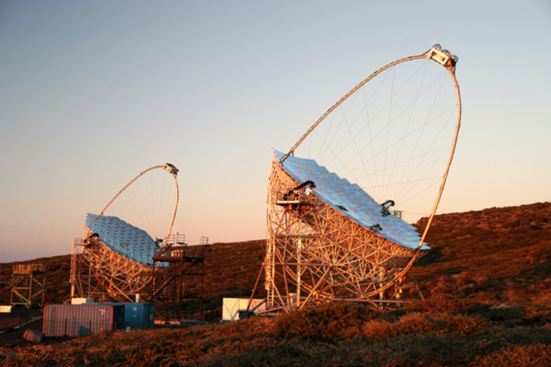
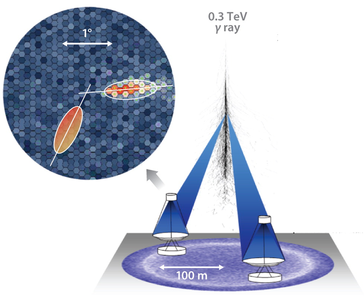
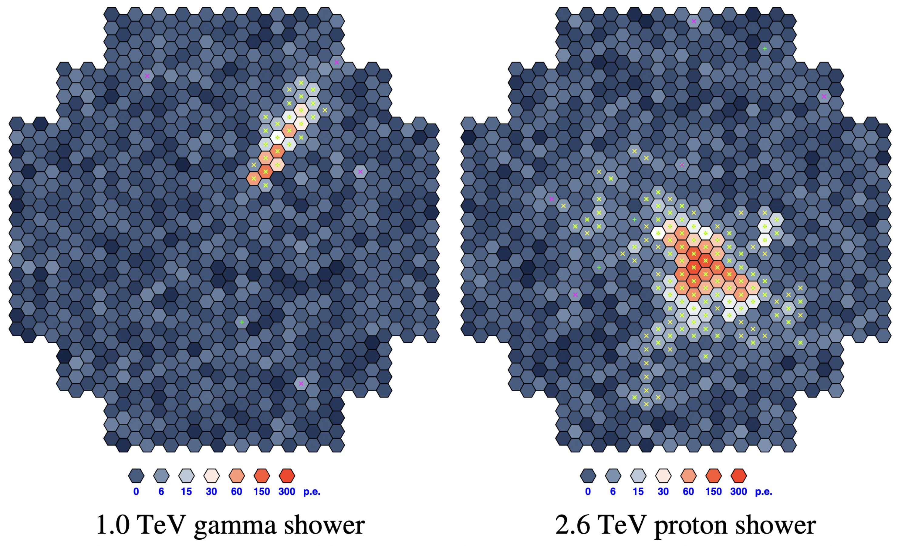

# Gamma vs Hadron Classification
This project aims to classify data from the MAGIC Gamma Telescope using different approaches, including standard machine learning methods (specifically XGBoost), as well as deep learning models such as Multilayer Perceptrons and Convolutional Neural Networks.  
The dataset analyzed was sourced from Kaggle and can be accessed at: https://www.kaggle.com/datasets/abhinand05/magic-gamma-telescope-dataset  

## MAGIC Telescope
MAGIC (Major Atmospheric Gamma Imaging Cherenkov telescope), located on the island of La Palma, is currently one of the largest ground-based gamma ray telescope.  
It detects particle showers produced by very high-energy gamma rays (on the order of TeV), thanks to the use of the Imaging Air Cherenkov Technique (IACT). When gamma rays interact electromagnetically with the Earth's atmosphere, they generate secondary particle which in turn yield a new generation of $\gamma$ rays through bremsstrahlung. Any secondary particle traveling faster than the speed of light in the atmosphere emits Cherenkov radiation, which is captured by the telescope. Throght the detection of this light images, it's possible to reconstruct both the longitudinal and lateral developmente of the electromagnetic shower, as well as determine the arrival direction of the primary gamma ray.  
This technique enables the experiment to identify cosmic gamma sources and investigate high-energy astrophysical phenomena such as pulsars, active galactic nuclei, and gamma-ray bursts.  

<table>
  <tr>
    <td></td>
    <td></td>
  </tr>
</table>

## Gamma versus Hadron discrimination
Many gamma ray experiments have to deal with the problem of separating showers produced by interesting gamma signals from the vast hadron events background.
The main differences between the two types of shower are the following:
- **Electromagnetic showers**: Initiated by photons and developed through a combination of processes such as pair production and bremsstrahlung.

- **Hadronic showers**: More complex in nature, as they involve not only electromagnetic but also strong interactions, resulting in multiple components. Each hadronic shower includes a hadronic component and an electromagnetic component, the latter arising from the production of neutral pions, which  in turn will generate gamma particles.

  

The task of distinguishing between these two types of showers is a recurring problem in the area of ground-based $\gamma$-ray astronomy and is commonly referred to as gamma/hadron separation.  
Typically, in order to achieve this separation the recorded images, after a necessary pre-processing, are parameterized using `Hillas' parameters. These are mainly a set of second moments which include image shape parameters (length (L) and width (W)) and image orientation parameters, like azwidth (A) and alpha ($\alpha$). Both simulation and experimental studies have shown that γ-ray images are more regular and compact with smaller L and W as compared with their cosmic-ray counterparts and have a well-defined major axis which, in the case of γ-rays coming from a point γ-ray source, is oriented closer towards the telescope axis.  

## Dataset Description
The MAGIC dataset used in this project contains MC-generated data characterized exactly by these Hillas parameters as features, specifically:

- fLength: major axis of ellipse [mm]
- fWidth: minor axis of ellipse [mm]
- fSize: 10-log of sum of content of all pixels [in #phot]
- fConc: ratio of sum of two highest pixels over fSize  [ratio]
- fConc1: ratio of highest pixel over fSize  [ratio]
- fAsym: distance from highest pixel to center, projected onto major axis [mm]
- fM3Long: 3rd root of third moment along major axis  [mm]
- fM3Trans: 3rd root of third moment along minor axis  [mm]
- fAlpha: angle of major axis with vector to origin [deg]
- fDist: distance from origin to center of ellipse [mm]
- class: gamma (signal), hadron (background)

Analysing such data it is fundamental to keep in mind that, according to the authors of the dataset, simple classification accuracy is not meaningful in this case, since classifying a background event as signal is worse than classifying a signal event as background. For this reason, to determine which machine learning method performs best, we used the AUC score and looked at the classification results when the probability of accepting a background event as signal is below the 0.05 threshold. 
The project was developed using the support of Google Colab and Drive in order to be able to wwork with the offered GPU ressoursed.

## The code

### 1_EDA_Magic.ipyng 

After downloading the data, an initial exploration of the dataset and feature distributions was performed. Duplicate entries were removed, and all events with a 'Width' value equal to zero were eliminated. This preprocessing step was essential to ensure a coherent dataset to use across all the various machine learning methods (especially the CNN).

Following the study of the features distribution and their correlation, the original features set was expanded adding four new features:

 - Eccentricity: To measures how much elongated is the event ellipse
 - Length_Width_Ratio: To quantify the direct proportionality between the major and minor axes
 - Rooted_Asym: To reduce the impact of extreme values while preserving directional information
 - Conc_Ratio: To represent the relative difference between the highest and top-two pixel intensities

Ultimately, the importance of these features was investigated to see if it was best to keep them all or to restrict their number. A baseline Random Forest classifier was first trained using all available features in order to establish a reference AUC score.
Then we applied three different feature selection techniques: Variance Threshold, SelectKBest, Recursive Feature Elimination. For each method the AUC scores was recalculated in order to assess the impact of feature reduction. Checking the results we didn't found a strong differnce between the scores, for this reason all features were kept for the subsequent machine learning training phase.  

### 2_Standard_ML_methods.ipyng 
Once the new features were established, training was carried out using different machine learning algorithms, including both scale-sensitive and scale-insensitive models. BY analyzing the ROC curves and the corresponding AUC scores, the best performing methods were: Random Forest, XGBoost and Support Vector Machine.
This result can be attributed to the ability of tthis models to handle non-linear relationships, characterized by noisy and correlated variables which are characteristics typical of Hillas parameters.  
Then a grid search was performed on all three models to optimize their regularization parameters in order to maximize classification performance in terms of AUC score.The most suitable model turned out to be XGBoost, then a custom classification threshold was selected to maximize the true positive rate while keeping the false positive rate below 0.05.
The model’s performance was evaluated using precision, recall, and the confusion matrix to ensure effective separation of gamma signals from background events.

