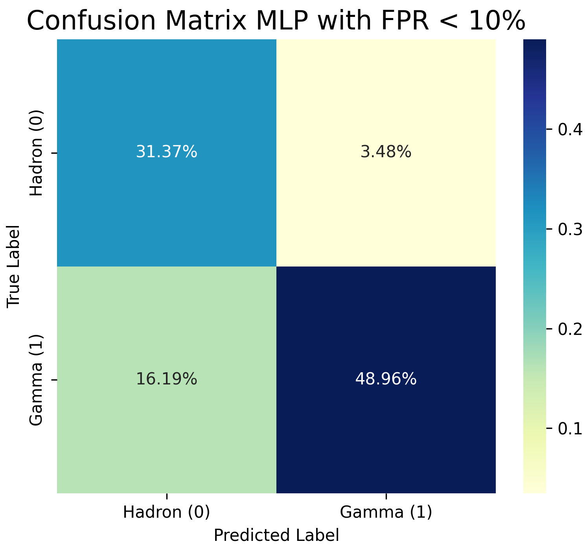
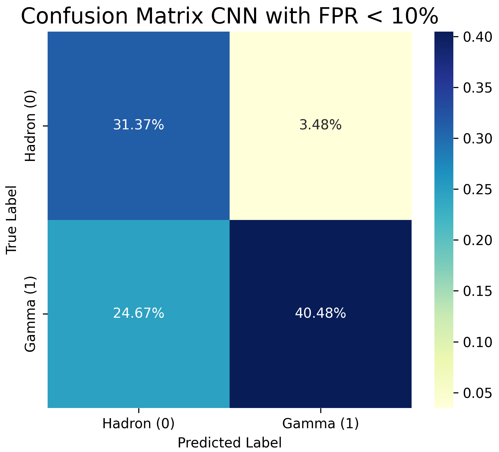
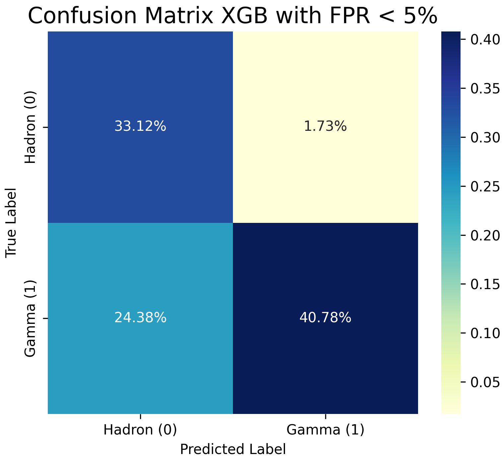

# Gamma vs Hadron Classification
This project aims to classify data from the MAGIC Gamma Telescope using different approaches, including standard machine learning methods (specifically XGBoost), as well as deep learning models such as Multilayer Perceptrons and Convolutional Neural Networks.  
The dataset analyzed was sourced from Kaggle and can be accessed at: https://www.kaggle.com/datasets/abhinand05/magic-gamma-telescope-dataset  

## MAGIC Telescope
MAGIC (Major Atmospheric Gamma Imaging Cherenkov telescope), located on the island of La Palma, is currently one of the largest ground-based gamma ray telescopes.  
It detects particle showers produced by very high-energy gamma rays (on the order of TeV), thanks to the use of the Imaging Air Cherenkov Technique (IACT). When gamma rays interact electromagnetically with the Earth's atmosphere, they generate secondary particles which in turn yield a new generation of $\gamma$ rays through bremsstrahlung. Any secondary particle traveling faster than the speed of light in the atmosphere emits Cherenkov radiation, which is captured by the telescope [1]. Through the detection of these light images, it's possible to reconstruct both the longitudinal and lateral development of the electromagnetic shower, as well as determine the arrival direction of the primary gamma ray.   
This technique enables the experiment to identify cosmic gamma sources and investigate high-energy astrophysical phenomena such as pulsars, active galactic nuclei, and gamma-ray bursts.  

<table>
  <tr>
    <td></td>
    <td></td>
  </tr>
</table>

## Gamma versus Hadron discrimination
Many gamma ray experiments have to deal with the problem of separating showers produced by interesting gamma signals from the vast hadronic background.
The main differences between the two types of showers are the following:
- **Electromagnetic showers**: Initiated by photons and developed through a combination of processes such as pair production and bremsstrahlung.

- **Hadronic showers**: More complex in nature, as they involve not only electromagnetic but also strong interactions, resulting in multiple components. Each hadronic shower includes a hadronic component and an electromagnetic one, the latter arising from the production of neutral pions, which in turn generate gamma particles.

  

The task of distinguishing between these two types of showers is a recurring problem in the area of ground-based $\gamma$-ray astronomy and is commonly referred to as gamma/hadron separation.  
Typically, to achieve this separation the recorded images, after a necessary preprocessing, are parameterized using Hillas parameters. These are mainly a set of second moments which include image shape parameters (length (L) and width (W)) and image orientation parameters, like azwidth (A) and alpha ($\alpha$). Both simulation and experimental studies have shown that γ-ray images are more regular and compact with smaller L and W as compared with their hadronic counterparts and have a well-defined major axis. Moreover, in the case of γ-rays coming from a point γ-ray source, this major axis is oriented closer towards the telescope axis [2]. 

## Dataset Description
The MAGIC dataset used in this project contains MC-generated data characterized exactly by these Hillas parameters as features, specifically:

- fLength: major axis of ellipse [mm]
- fWidth: minor axis of ellipse [mm]
- fSize: 10-log of sum of content of all pixels [in #phot]
- fConc: ratio of sum of two highest pixels over fSize  [ratio]
- fConc1: ratio of highest pixel over fSize  [ratio]
- fAsym: distance from highest pixel to center, projected onto major axis [mm]
- fM3Long: 3rd root of third moment along major axis  [mm]
- fM3Trans: 3rd root of third moment along minor axis  [mm]
- fAlpha: angle of major axis with vector to origin [deg]
- fDist: distance from origin to center of ellipse [mm]
- class: gamma (signal), hadron (background)

Analysing such data, it is fundamental to keep in mind that, according to the authors of the dataset, simple classification accuracy is not meaningful in this case, since classifying a background event as signal is worse than classifying a signal event as background. For this reason, to determine which machine learning method performs best, we used the AUC score and looked at the classification results when the probability of accepting a background event as a signal is below a certain threshold. 
The project was developed using the support of Google Colab and Google Drive in order to be able to work with the offered GPU resources.

## The code

### 1_EDA_Magic.ipynb 

After downloading the data, an initial exploration of the dataset and feature distributions was performed. Duplicate entries were removed, and all events with a 'Width' value equal to zero were eliminated. This preprocessing step was essential to ensure a coherent dataset to use across all the various machine learning methods, especially the CNN, where events with null Width would not have allowed for proper image generation.

Following the study of the feature distributions and their correlation, the original features set was expanded by adding four new ones:

 - Eccentricity: To measure how much the event ellipse is elongated
 - Length_Width_Ratio: To quantify the direct proportionality between the major and minor axes
 - Rooted_Asym: To reduce the impact of extreme values while preserving directional information
 - Conc_Ratio: To represent the ratio between the highest top two pixel intensities

Ultimately, the importance of these features was investigated to see if it was best to keep them all or to restrict their number. A baseline Random Forest classifier was first trained using all available features in order to establish a reference AUC score.
Then we applied three different feature selection techniques: Variance Threshold, SelectKBest and Recursive Feature Elimination. For each method, the AUC scores were recalculated in order to assess the impact of feature reduction. As the results did not show a significant difference in AUC scores, all features were preserved for the subsequent machine learning phase, also considering that deep learning models can potentially capture complex and non-obvious feature relationships.

### 2_Standard_ML_methods.ipynb 

Once the new features were established, training was carried out using different machine learning algorithms, including both scale-sensitive and scale-insensitive models. By analyzing the ROC curves and the corresponding AUC scores, the best performing methods were: Random Forest, XGBoost and Support Vector Machine.  
This result can be attributed to the ability of these models to handle non-linear relationships, characterized by noisy and correlated variables, which are characteristics typical of Hillas parameters.   

  

Then a grid search was performed on all three models to optimize their regularization parameters in order to maximize classification performance in terms of AUC score. The most suitable model turned out to be XGBoost.  
Custom classification thresholds were then selected to maximize the number of true positives while keeping the false positive rate below 5% or 10%, depending on the desired level of sensitivity.
The model’s performance was evaluated using precision, recall, and the confusion matrix to ensure effective separation of gamma signals from background events.

### 3_MLP_Magic.ipynb

With this script, we build and train a Multilayer Perceptron (MLP) to analyse our dataset trying to distinguish between hadrons and gammas. A multi-layer perceptron (MLP) is a type of feedforward neural network consisting of multiple layers of neurons, which typically use nonlinear activation functions, allowing the network to learn complex patterns in data. For this reason, they are significant in machine learning due to their ability to model nonlinear relationships in data, making them powerful tools for tasks such as classification [3].  
We used the Hyperband optimization algorithm to choose the optimal set of hyperparameters that minimizes the AUC score of the classifier.
The hyperparameter search was done on the number of layers and relative neurons, on the best learning rate and on the dropout rate of the dropout layers.  
Then again, after applying the custom thresholds, the best model precision, recall, and the confusion matrix were calculated.

### 4_CNN_Magic.ipynb

Lastly, we tried to approach the problem differently: the Hillas parameters present in the dataframe were employed to build an image of the cosmic ray detected. In particular, we used 'fLength', 'fWidth' and 'fAlpha' to define the base ellipse, while two symmetrical Gaussian peaks were added along the major axis at a distance of 'fAsym' from the ellipse center. The color intensity of the ellipse and the two peaks was calculated using 'fSize', 'fConc' and 'fConc1', then we checked the images created to see if the parameters were used correctly.  

  

At this point, these images were normalized using their maximum pixel value and then fed to the Convolutional Neural Network (CNN) model chosen for its ability to effectively capture spatial hierarchies and local patterns in data.  
Also here the Hyperband algorithm was applied to decide the optimal number of neurons, dropout rate, and learning rate for maximizing the AUC score. Once the best model was found, the precision, recall, and confusion matrix were estimated in order to enable a comparison across the three different methods.

Both the MLP and the CNN tuner results can be download [here](https://drive.google.com/drive/folders/1nCyL1IJ8EObaw9-AC2dTRCmDVt7AW5m1?usp=sharing)  

## Results

In this project we attempted to solve the problem of gamma and hadron separation using three different classifiers built using XGBoost, Multilayer Perceptron and Convolutional Neural Networks, respectively. Following the dataset instructions we looked for the best model able to minimize the number of False Positives without losing too many true signals. To ensure a fair comparison, we applied two custom classification thresholds: one where the probability of misclassifying a background event as a gamma is kept below 5%, and another where this probability is raised to 10%. These thresholds allowed us to evaluate the models' performance under different levels of sensitivity.  

<table align="center">
  <thead>
    <tr>
      <th style="text-align:left; width:280px;"></th>
      <th style="text-align:center; width:280px;">XGB</th>
      <th style="text-align:center; width:280px;">MLP</th>
      <th style="text-align:center; width:280px;">CNN</th>
    </tr>
  </thead>
  <tbody>
    <tr>
      <td>AUC</td>
      <td style="text-align:center;">&nbsp;&nbsp;&nbsp;&nbsp;&nbsp;&nbsp;0.938&nbsp;&nbsp;&nbsp;&nbsp;&nbsp;&nbsp;</td>
      <td style="text-align:center;">&nbsp;&nbsp;&nbsp;&nbsp;&nbsp;&nbsp;0.930&nbsp;&nbsp;&nbsp;&nbsp;&nbsp;&nbsp;</td>
      <td style="text-align:center;">&nbsp;&nbsp;&nbsp;&nbsp;&nbsp;&nbsp;0.886&nbsp;&nbsp;&nbsp;&nbsp;&nbsp;&nbsp;</td>
    </tr>
    <tr>
      <td>Precision (5%)</td>
      <td style="text-align:center;">&nbsp;&nbsp;&nbsp;&nbsp;&nbsp;&nbsp;0.959&nbsp;&nbsp;&nbsp;&nbsp;&nbsp;&nbsp;</td>
      <td style="text-align:center;">&nbsp;&nbsp;&nbsp;&nbsp;&nbsp;&nbsp;0.956&nbsp;&nbsp;&nbsp;&nbsp;&nbsp;&nbsp;</td>
      <td style="text-align:center;">&nbsp;&nbsp;&nbsp;&nbsp;&nbsp;&nbsp;0.950&nbsp;&nbsp;&nbsp;&nbsp;&nbsp;&nbsp;</td>
    </tr>
    <tr>
      <td>Recall (5%)</td>
      <td style="text-align:center;">&nbsp;&nbsp;&nbsp;&nbsp;&nbsp;&nbsp;0.626&nbsp;&nbsp;&nbsp;&nbsp;&nbsp;&nbsp;</td>
      <td style="text-align:center;">&nbsp;&nbsp;&nbsp;&nbsp;&nbsp;&nbsp;0.577&nbsp;&nbsp;&nbsp;&nbsp;&nbsp;&nbsp;</td>
      <td style="text-align:center;">&nbsp;&nbsp;&nbsp;&nbsp;&nbsp;&nbsp;0.500&nbsp;&nbsp;&nbsp;&nbsp;&nbsp;&nbsp;</td>
    </tr>
    <tr>
      <td>Precision (10%)</td>
      <td style="text-align:center;">&nbsp;&nbsp;&nbsp;&nbsp;&nbsp;&nbsp;0.935&nbsp;&nbsp;&nbsp;&nbsp;&nbsp;&nbsp;</td>
      <td style="text-align:center;">&nbsp;&nbsp;&nbsp;&nbsp;&nbsp;&nbsp;0.934&nbsp;&nbsp;&nbsp;&nbsp;&nbsp;&nbsp;</td>
      <td style="text-align:center;">&nbsp;&nbsp;&nbsp;&nbsp;&nbsp;&nbsp;0.921&nbsp;&nbsp;&nbsp;&nbsp;&nbsp;&nbsp;</td>
    </tr>
    <tr>
      <td>Recall (10%)</td>
      <td style="text-align:center;">&nbsp;&nbsp;&nbsp;&nbsp;&nbsp;&nbsp;0.773&nbsp;&nbsp;&nbsp;&nbsp;&nbsp;&nbsp;</td>
      <td style="text-align:center;">&nbsp;&nbsp;&nbsp;&nbsp;&nbsp;&nbsp;0.752&nbsp;&nbsp;&nbsp;&nbsp;&nbsp;&nbsp;</td>
      <td style="text-align:center;">&nbsp;&nbsp;&nbsp;&nbsp;&nbsp;&nbsp;0.621&nbsp;&nbsp;&nbsp;&nbsp;&nbsp;&nbsp;</td>
    </tr>
  </tbody>
</table>

When analyzing the results at the 10% threshold, XGBoost emerged as the best-performing model. It achieved the highest AUC score and managed to keep the false positive rate low without losing too many gamma events. The MLP also performed quite well, but it required significantly more training time compared to the XGB and still did not manage to match its performance. Finally, the CNN was found to be the worst model. This is likely due to the fact that the images it analyses were artificially generated and contained less detailed information compared to the tabular data. Having a clearer representation of the spatial distribution of the key pixels might improve its performance.

<table>
  <tr>
    <td></td>
    <td></td>
    <td></td>
  </tr>
</table>

The outputs are similar also selecting a more stringent threshold at 5%: the best model remains the XGB, although the number of misclassified gamma events increased significantly. On the other hand, both the MLP and CNN struggled to maintain good separation, with the number of gammas misteken for hadrons almost equal to those rightly identified.

<table>
  <tr>
    <td></td>
    <td></td>
    <td></td>
  </tr>
</table>

## Conclusions
This project demonstrates how both traditional machine learning and deep learning techniques can be applied to the challenging task of gamma/hadron separation in ground-based gamma ray astronomy. Among the tested models, XGBoost emerged as the best one, not only for its strong perfomance but also for its relatively short training time. The MLP also showed promising results, although at a higher computational cost, while the CNN, despite its potential for image-based analysis, underperformed—likely due to limitations in the way input images were generated from tabular data.  
Nevertheless, there is still room for improvement across all the models presented, where more suitable architectures and hyperparameter configurations could be further explored. In this work a selection was made regarding which models to consider but, given the incredibly large number of existing classifiers, there are certainly other approaches that could be used and studied in depth.

## Bibliography 

[1] Maurizio Spurio, " Probes of Multimessenger Astrophysics - Charged cosmic rays, neutrinos, γ-rays and gravitational waves", Springer (2018).  
[2] arXiv:astro-ph/0109476v1
[3] Multilayer Perceptrons in Machine Learning: A Comprehensive Guide. https://www.datacamp.com/tutorial/multilayer-perceptrons-in-machine-learning  
[4] https://medium.com/@heyamit10/hyperband-hyperparameter-optimization-d7bd66faa8e8 and arXiv:1603.06560
